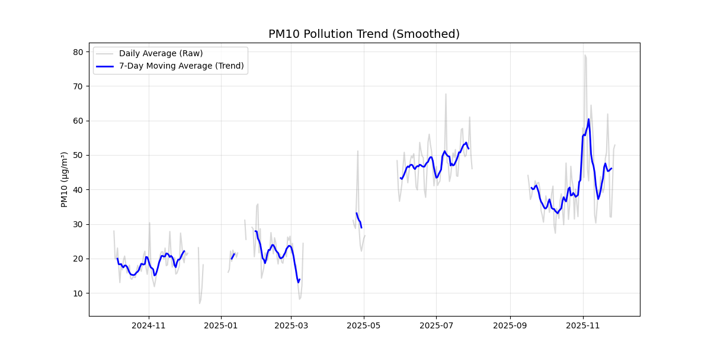

# Air Quality & Weather Analysis Report
**DSA210 Project - Kadıköy Analysis**

## 1. Introduction & Hypothesis
**Project Hypothesis:** Meteorological factors (specifically precipitation and wind speed) serve as the primary natural determinants of urban air quality, while human activity cycles (rush hour) serve as the primary anthropogenic determinant.

**Data Coverage & Methodology:**
We successfully merged and cleaned **5,945 hourly observations** from Oct 2024 to Nov 2025.
* **Cleaning:** Data was cleaned to handle missing values and timezone offsets were standardized.

## 2. Statistical Hypothesis Tests
To validate the hypothesis, we performed two **Welch’s T-tests**.
* We chose Welch's T-test over the T-test because our samples (Rainy vs. Dry days) have unequal sample sizes and unequal variances.

### Test A: The Washout Effect (Rain)
* **Null Hypothesis ($H_0$):** Mean PM10 is equal on rainy and dry days.
* **Alternative ($H_1$):** Mean PM10 is lower on rainy days (Precipitation cleans the air).

**Results:**
* **Mean Pollution (Dry):** 33.70 µg/m³
* **Mean Pollution (Rainy):** 26.47 µg/m³
* **Difference:** -7.23 µg/m³ (~21.5% reduction)
* **P-value:** `1.42e-44` ($p < 0.001$)

> **Conclusion:** **Highly Significant.** We reject the null hypothesis. Rain acts as a powerful "air scrubber," reducing particulate matter by over 20%.

### Test B: The Ventilation Effect (Wind)
* **Null Hypothesis ($H_0$):** Mean PM10 is equal in stagnant vs. ventilated air.
* **Alternative ($H_1$):** Mean PM10 is higher in stagnant air (< 10 km/h).

**Results:**
* **Mean Pollution (Stagnant):** 34.41 µg/m³
* **Mean Pollution (Ventilated):** 32.66 µg/m³
* **P-value:** `5.35e-04` ($p < 0.001$)

> **Conclusion:** **Statistically Significant.** We reject the null hypothesis. Stagnant conditions trap pollutants, significantly raising average concentrations.

## 3. Visualizations & Exploratory Data Analysis (EDA)

### A. Correlation Analysis

We analyzed the Pearson correlation coefficients ($r$) along with their p-values to ensure statistical validity ($N=5,945$).

* **Temperature vs. PM10 ($r = 0.59$, $p < 0.001$):** A strong positive correlation. Warmer periods in this dataset coincide with higher pollution, likely due to dry summer conditions favoring dust resuspension.
* **Wind Speed vs. PM10 ($r = -0.15$, $p < 0.001$):** A statistically significant negative correlation. Stronger winds dilute pollution.
* **Humidity vs. PM10 ($r = -0.20$, $p < 0.001$):** Moderate negative correlation; moist air helps suppress dust.

### B. Scatter Plot (Wind vs. Pollution)

* **The "L-Shape":** The plot reveals that extreme pollution events (>100 µg/m³) occur *exclusively* at low wind speeds (< 10 km/h). This visually confirms the "Ventilation Effect" tested in Section 2.

### C. Time Series Analysis (Smoothed)

* **Stochasticity:** The raw hourly data is highly stochastic. By applying a 7-day moving average, the underlying seasonal trends become visible.
* **Seasonality:** We observe distinct volatility clusters. Contrary to the expectation of winter-only pollution, we see significant spikes in warmer months, aligning with the temperature correlation found in Section 3A.

### D. Data Distribution

* **Skewness:** The data is heavily left-skewed. Most hours show "Good" air (20–40 µg/m³), but the "long tail" represents rare but hazardous outlier events.

### E. Hourly Trends (Rush Hour Effect)

* **The "M" Shape:** A clear bimodal distribution is visible.
    1.  **09:00 Spike:** Morning rush hour.
    2.  **17:00 Spike:** Evening rush hour + residential heating/cooking.
* **Baseline:** The cleanest air consistently occurs between 02:00–04:00 (minimum human activity).

## 4. Machine Learning Analysis
We applied Machine Learning (Random Forest) to the 5,945 observations to predict air quality.

### A. Predictive Modeling (Regression)
* **Model:** `RandomForestRegressor`
* **R² Score:** `0.86`
* **MAE:** `3.97 µg/m³`

> **Conclusion:** The high R² (0.86) proves that air quality is not random; it is highly predictable based on the interaction of Weather (Rain/Wind) and Time (Traffic cycles).

### B. Risk Classification
We trained a classifier to predict "Poor Air" events (> 40 µg/m³).
* **Accuracy:** `93%`
* **Precision (Poor Air):** `0.92`
* **Recall (Poor Air):** `0.87`

> **Conclusion:** The model successfully catches 87% of pollution spikes, making it a viable tool for public health warnings.

### C. Feature Importance
![Feature Importance]images/(ml_feature_importance.png)
The model identified the drivers of pollution in this order:
1.  **Time (Hour/Month):** The dominant factor (Human activity).
2.  **Wind Speed:** The dominant natural factor (Ventilation).
3.  **Temperature:** A secondary seasonal proxy.