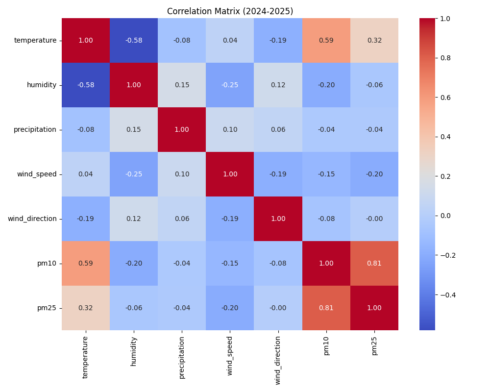
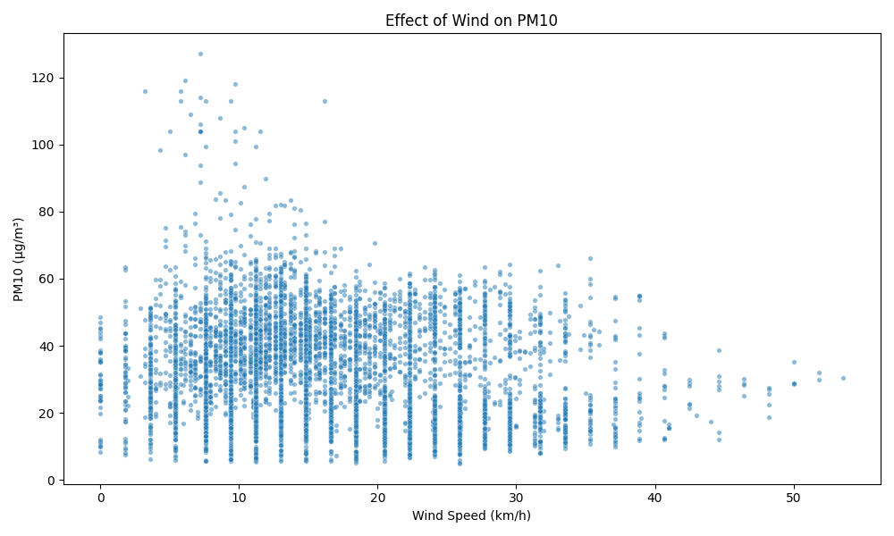
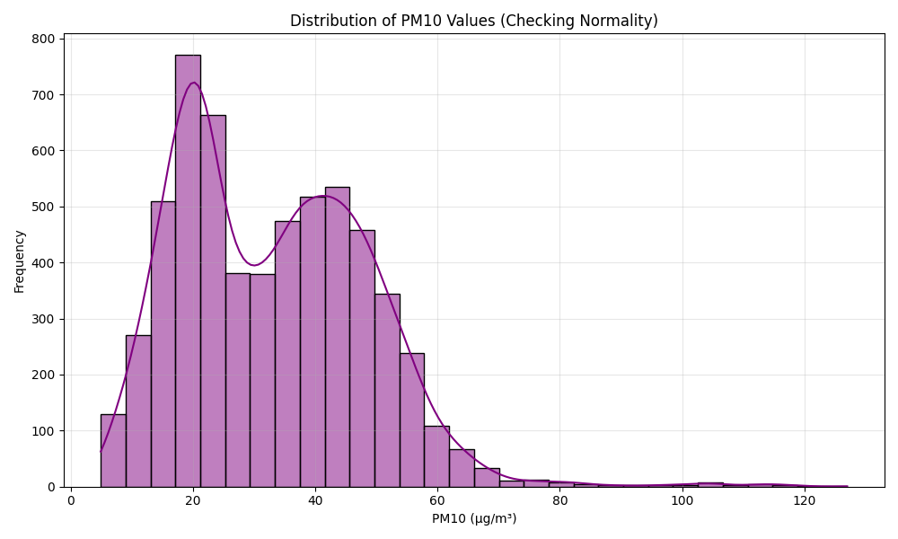
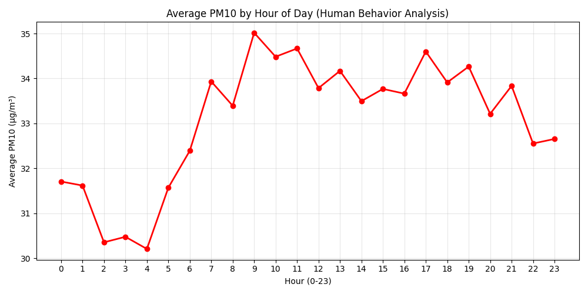

# Air Quality & Weather Analysis Report
**DSA210 Project - Kadıköy Analysis**

**Data Coverage:** Successfully merged and cleaned 5,945 hourly observations from Oct 2024 to Nov 2025. This dataset covers a full annual cycle, allowing for the detection of both seasonal and daily patterns in the Kadıköy district.

## 1. Statistical Hypothesis Tests
We performed two Welch's T-tests to validate how meteorological factors (precipitation and wind) impact PM10 concentrations.

### Test A: The Washout Effect (Rain)
We tested if rain significantly reduces PM10 pollution.
* **Null Hypothesis ($H_0$):** Mean PM10 is the same on rainy vs. dry days.
* **Alternative ($H_1$):** Mean PM10 differs on rainy days.

**Results:**
* **Mean Pollution (Dry):** 33.70 µg/m³
* **Mean Pollution (Rainy):** 26.47 µg/m³
* **Difference:** -7.23 µg/m³ (~21.5% reduction)
* **P-value:** `1.4222e-44`

> **Conclusion:** **Highly Significant.** Rain acts as a powerful "air scrubber," reducing particulate matter by over 20%.

### Test B: The Ventilation Effect (Wind)
We tested if stagnant air (wind speed < 10 km/h) leads to higher pollution accumulation compared to ventilated air (≥ 10 km/h).
* **Null Hypothesis ($H_0$):** Mean PM10 is the same in stagnant vs. ventilated air.
* **Alternative ($H_1$):** Mean PM10 is higher in stagnant air.

**Results:**
* **Mean Pollution (Stagnant < 10 km/h):** 34.41 µg/m³
* **Mean Pollution (Ventilated ≥ 10 km/h):** 32.66 µg/m³
* **Difference:** 1.75 µg/m³ higher in stagnant air
* **P-value:** `5.3503e-04`

> **Conclusion:** **Statistically Significant.** The low p-value ($p < 0.05$) confirms that wind speed is a statistically significant factor in air quality. Stagnant conditions trap pollutants, raising the average concentration, though the "cleaning" effect of wind in this dataset is less drastic than that of rain (1.75 µg/m³ diff vs 7.23 µg/m³ diff).

## 2. Visualizations & Exploratory Data Analysis (EDA)

### A. Correlation Matrix

* **Key Finding (Temperature):** We observe a strong positive correlation between Temperature and PM10 ($r \approx 0.59$). This suggests that in this specific dataset, warmer periods coincided with higher particulate matter—potentially due to dry, dusty summer conditions or photochemical smog formation.
* **Key Finding (Wind):** A negative correlation ($r \approx -0.15$) exists between Wind Speed and PM10. This confirms the physical mechanism of dispersion: stronger winds dilute local pollution concentrations.
* **Key Finding (Humidity):** Humidity shows a moderate negative correlation ($r \approx -0.20$), further supporting the idea that moist air (often associated with rain/wind) helps suppress dust resuspension.

### B. Scatter Plot (Wind vs. Pollution)

* **Ventilation Threshold:** The plot exhibits a classic "L-shape" distribution. High pollution events (>100 µg/m³) occur exclusively at low wind speeds (typically < 10 km/h).
* **Insight:** The plot shows an "L-shape," where extreme pollution events (>100 µg/m³) occur exclusively at low wind speeds. This aligns with our statistical test in Section 1, which confirmed that stagnant air (< 10 km/h) significantly retains more particulate matter than ventilated air ($p = 0.0005$).

### C. Time Series Analysis

* **Seasonality:** The data reveals distinct seasonal variance. While we expected winter peaks due to heating, the strong correlation with temperature noted in Section A suggests we should also investigate summer anomalies (e.g., Saharan dust transport events or construction activity during dry months).
* **Volatility:** The variance in pollution levels is not constant; we see clusters of high-volatility days followed by periods of relatively clean, stable air.

### D. Data Distribution Analysis

* **Skewness:** The data is heavily left-skewed. The majority of hours have "Good" to "Moderate" air quality (20–40 µg/m³), but the long tail extending to the right represents extreme outlier events that pose the greatest health risks.
* **Statistical Note:** Although the data is not perfectly normal, the large sample size ($N > 5000$) ensures the validity of our T-test via the Central Limit Theorem.

### E. Hourly Trends (Rush Hour Effect)

**Insight into Human Behavior:**
* **The "M" Shape:** The plot reveals a bimodal distribution characteristic of urban environments.
* **Morning Spike (09:00):** A sharp rise correlates with morning rush hour traffic.
* **Evening Spike (16:00 - 17:00):** A second, often broader peak occurs in the evening, likely driven by a combination of rush hour traffic returning home and the onset of residential activities (cooking/heating).
* **The Baseline:** The lowest values typically occur in the early morning (02:00 - 04:00). This period represents the "background" pollution level of the city when anthropogenic (human) activity is at its minimum.